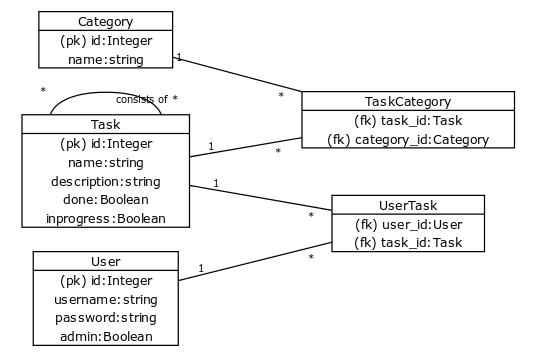

## About database

The database consists of three main tables: user, task and category. The relations between them are many-to-many:
- A user can 'have' (= mark done or in progress) any number of tasks, and a task can be marked by any number of users.
- A task can have any number of categories, and many tasks can belong to the same category.
- A task can have any number of subtasks, and a subtask can be a part of any number of tasks.

First draft of the database as a diagram:

 