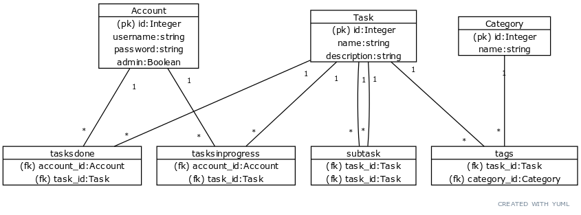

## About database

The database consists of three main tables: `account`, `task` and `category` and four association tables: `tasksdone`, `tasksinprogress`, `tags` and `subtasks`. The relations between them are many-to-many:
- A user can mark done or in progress any number of tasks, and a task can be marked by any number of users.
    - association tables `tasksdone` and `tasksinprogress`
- A task can have any number of categories, and many tasks can belong to the same category.
    - association table `tags`
- A task can have any number of subtasks, and a subtask can be a part of any number of tasks.
    - association table `subtasks`

A scheme of the database as a diagram:

 

### Create table clauses

`CREATE TABLE category (
        id INTEGER NOT NULL, 
        date_created DATETIME, 
        date_modified DATETIME, 
        name VARCHAR(144) NOT NULL, 
        PRIMARY KEY (id)
)`

`CREATE TABLE task (
        id INTEGER NOT NULL, 
        date_created DATETIME, 
        date_modified DATETIME, 
        name VARCHAR(144) NOT NULL, 
        description VARCHAR(200) NOT NULL, 
        PRIMARY KEY (id)
)`

`CREATE TABLE account (
        id INTEGER NOT NULL, 
        date_created DATETIME, 
        date_modified DATETIME, 
        username VARCHAR(144) NOT NULL, 
        _password VARCHAR(144) NOT NULL, 
        admin BOOLEAN NOT NULL, 
        PRIMARY KEY (id), 
        UNIQUE (username), 
        CHECK (admin IN (0, 1))
)`

`CREATE TABLE subtask (
        supertask_id INTEGER NOT NULL, 
        subtask_id INTEGER NOT NULL, 
        PRIMARY KEY (supertask_id, subtask_id), 
        FOREIGN KEY(supertask_id) REFERENCES task (id), 
        FOREIGN KEY(subtask_id) REFERENCES task (id)
)`

`CREATE TABLE tags (
        category_id INTEGER, 
        task_id INTEGER, 
        FOREIGN KEY(category_id) REFERENCES category (id), 
        FOREIGN KEY(task_id) REFERENCES task (id)
)`

`CREATE TABLE tasksdone (
        account_id INTEGER, 
        task_id INTEGER, 
        FOREIGN KEY(account_id) REFERENCES account (id), 
        FOREIGN KEY(task_id) REFERENCES task (id)
)`

`CREATE TABLE tasksinprogress (
        account_id INTEGER, 
        task_id INTEGER, 
        FOREIGN KEY(account_id) REFERENCES account (id), 
        FOREIGN KEY(task_id) REFERENCES task (id)
)`